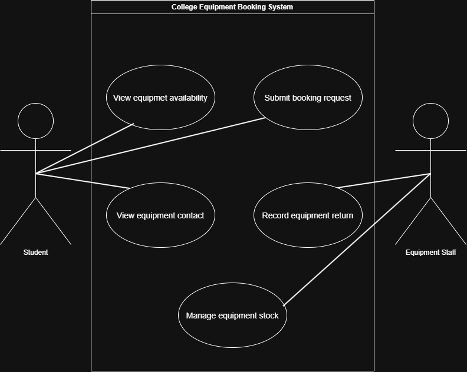
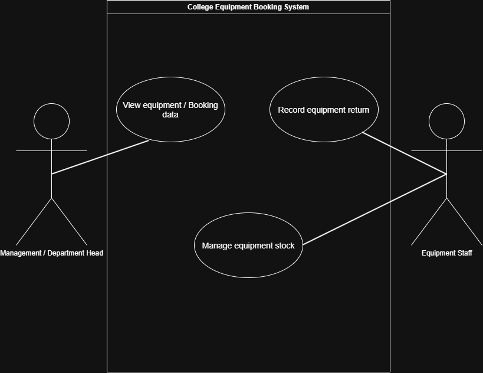

# Week 4 - Requirements Modelling

## Contents
* [Diagram 1 - Student and Equipment Staff](#diagram-1---student-and-equipment-staff)
* [Diagram 2 - Equipment Staff and Management](#diagram-2---equipment-staff-and-management)
* [Reflection](#reflection)

[Back to README](/README.md)

## Diagram 1 - Student and Equipment Staff

## Requirement used

The diagram is based on the functional requirements identified in week 3. These include allowing authorised users to view equipment availability, submit booking requests and display the primary staff contact for equipment.

The diagram also represents equipment return and stock management based on the requirements and information identified during week 1-3.

### Actors

**Student**

The student is an authorised user who needs to view equipment availability, submit booking requests and access equipment contact information.

**Equipment Staff**

Equipment Staff are involved in managing equipment stock and recording equipment returns.

### Use Cases

* **View Equipment Availability** - allows an authorised user to check whether equipment is available
* **Submit Booking Request** - allows an authorised user to submit a request for equipment for a specified date and time. 
* **View Equipment Contact** - displays the primary staff contact name and email for an equipment item
* **Record Equipment Return** - records the return of equipment so that its availability can be updated
* **Manage Equipment Stock** - allows staff to modify the equipment stock list

### Unknows / Questions

The exact permissions for students and staff are not fully defined. In particular, it is not yet clear whether all authorised users have the same access or whether different equipment requires different levels of authorisation.

## Diagram 2 - Equipment Staff and Management

### Requirements Used

This diagram focuses on the equipment management side of the system.

The week 1 requirements identified that staff should be able to modify the equipment stock list. The requirements and elicitation work also identified the need to track equipment returns and only make equipment available again once it has been physically returned.

Management / Deparment Head access is included based on the stakeholder information from week 1 which identified that management should be able to access equipment and booking data.

### Actors

**Equipment Staff**

Equipment staff are responsible for managing the equipment stock and recording equipment returns.

**Management / Department Head**

They are stakeholders who may need access to equipment and booking information (in case of damages, loss prevention, etc.)

### Use Cases

* **Manage Equipment Stock** - allows staff to modify the equipment stock list
* **Record Equipment Return** - records when equipment has been returned so that its availability can be updated
* **View Equipment / Booking data** - represents the potential need for management / department heads to access equipment and booking information

### Unknows / Questions

The exact information that management should be able to access has not yet been defined.

It is also unclear whether mangement should have read-only access or whether they should be able to modify any equipment or booking information.

Further clarification would be needed from management before defining their permissions in more detail.

## Reflection

* The use case diagram helped me understand how the different users of the College Equipment Booking System interact with the system and what their main goals are.
* The diagrams also revealed that the exact permissions for different users are not fully defined. In particular, it is still unclear what information management shold be able to access and whether they should have read-only or editing permissions.

